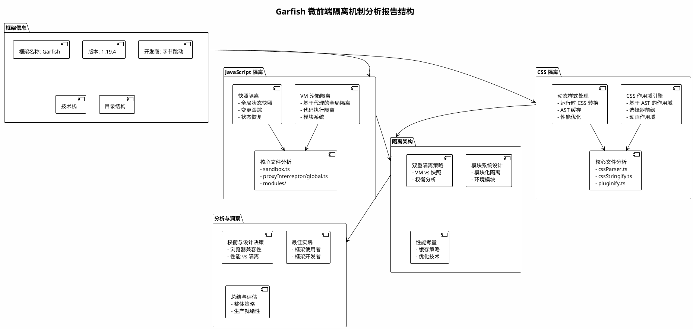

# Garfish 微前端框架隔离机制分析

## 框架信息

- **框架名称**: Garfish
- **版本**: 1.19.4
- **开发商**: 字节跳动
- **技术栈**: TypeScript, ES6+, Webpack
- **开源协议**: MIT
- **代码仓库**: https://github.com/bytedance/garfish

### 架构概览

Garfish 是一个功能强大的微前端框架，通过模块化架构提供全面的隔离机制：

```
garfish/
├── packages/
│   ├── core/              # 核心框架逻辑
│   ├── browser-vm/        # JavaScript VM 沙箱隔离
│   ├── browser-snapshot/  # JavaScript 快照隔离
│   ├── css-scope/         # CSS 作用域隔离
│   ├── loader/            # 资源加载
│   ├── router/            # 路由管理
│   └── bridge-*/          # 框架桥接 (React, Vue)
```

### 整体结构



## JavaScript 隔离实现

Garfish 实现了**双重 JavaScript 隔离策略**，确保强健的微前端隔离：

### 1. VM 沙箱隔离 (`@garfish/browser-vm`)

**核心文件:**

- `packages/browser-vm/src/sandbox.ts` - 主要沙箱实现
- `packages/browser-vm/src/proxyInterceptor/global.ts` - 全局代理处理器
- `packages/browser-vm/src/modules/` - 环境模块（document、history 等）

**实现机制:**

#### 基于代理的全局隔离

```typescript
// 核心代理窗口创建
createProxyWindow(moduleKeys: Array<string> = []) {
  const fakeWindow = createFakeObject(window, this.isInsulationVariable, makeMap(moduleKeys));

  const proxy = new Proxy(fakeWindow, {
    get: createGetter(this),
    set: createSetter(this),
    defineProperty: createDefineProperty(this),
    deleteProperty: createDeleteProperty(this),
    has: createHas(this)
  });

  return proxy;
}
```

**关键特性:**

- **虚拟窗口对象**: 为每个微前端创建隔离的窗口代理
- **属性拦截**: 所有全局变量访问/修改都被拦截
- **上下文绑定**: 自动将 DOM/BOM 方法绑定到原生窗口
- **保护变量**: 支持绕过隔离的保护变量
- **隔离变量**: 每个微前端完全隔离的变量

#### 代码执行隔离

```typescript
execScript(code: string, env = {}, url = '', options?: interfaces.ExecScriptOptions) {
  const codeRef = { code };
  const params = this.createExecParams(codeRef, env);

  // 使用 with 语句进行变量作用域控制
  if (!this.options.disableWith) {
    codeRef.code = `with(window) {;${this.optimizeCode + codeRef.code}\n}`;
  }

  evalWithEnv(codeRef.code, params, this.global);
}
```

**优化特性:**

- **With 语句优化**: 预声明常用全局方法以避免代理开销
- **方法缓存**: 缓存绑定方法以提高性能
- **环境变量**: 支持自定义环境注入

### 2. 快照隔离 (`@garfish/browser-snapshot`)

**核心文件:**

- `packages/browser-snapshot/src/sandbox.ts` - 快照沙箱实现
- `packages/browser-snapshot/src/patchers/variable.ts` - 全局变量补丁

**实现机制:**

#### 全局状态快照

```typescript
class PatchGlobalVal {
  public snapshotOriginal = new Map();
  private snapshotMutated = new Map();

  activate() {
    // 记录当前全局状态
    this.safeIterator((key: string) => {
      this.snapshotOriginal.set(key, this.targetToProtect[key]);
    });

    // 恢复之前的修改
    this.snapshotMutated.forEach((val, mutateKey) => {
      this.targetToProtect[mutateKey] = this.snapshotMutated.get(mutateKey);
    });
  }

  deactivate() {
    // 捕获修改并恢复原始状态
    this.safeIterator((normalKey: string) => {
      if (this.snapshotOriginal.get(normalKey) !== this.targetToProtect[normalKey]) {
        this.snapshotMutated.set(normalKey, this.targetToProtect[normalKey]);
        this.targetToProtect[normalKey] = this.snapshotOriginal.get(normalKey);
      }
    });
  }
}
```

**关键特性:**

- **状态捕获**: 在微前端激活前记录全局状态
- **变更跟踪**: 跟踪执行期间的所有全局变量变化
- **状态恢复**: 微前端停用时恢复原始状态
- **副作用管理**: 全面的副作用清理（定时器、事件等）

## CSS 隔离实现

### CSS 作用域引擎 (`@garfish/css-scope`)

**核心文件:**

- `packages/css-scope/src/cssParser.ts` - CSS AST 解析器（504 行）
- `packages/css-scope/src/cssStringify.ts` - CSS 作用域编译器（244 行）
- `packages/css-scope/src/pluginify.ts` - 集成插件

**实现机制:**

#### 基于 CSS AST 的作用域处理

```typescript
// CSS 解析和转换
export function stringify(node: StylesheetNode, id: string) {
  const compiler = new Compiler(id);
  return compiler.compile(node);
}

class Compiler {
  addScope(selectors: Array<string>) {
    if (!this.id) return selectors;

    return selectors.map((s) => {
      // 处理特殊选择器
      s = s === 'html' || s === ':root'
        ? `[${__MockHtml__}]`
        : s === 'body'
          ? `[${__MockBody__}]`
          : s === 'head'
            ? `[${__MockHead__}]`
            : s;
      return `#${this.id} ${s}`;  // 添加微前端 ID 前缀
    });
  }
}
```

**作用域策略:**

- **ID 前缀**: 所有选择器都添加唯一的微前端 ID 前缀
- **HTML 元素映射**: 将 html/body/head 映射到模拟属性
- **动画作用域**: 关键帧动画使用 ID 后缀进行作用域控制
- **媒体查询保持**: 媒体查询在规则内保持隔离

#### 动态样式处理

```typescript
// 运行时 CSS 转换
proto.transformCode = function (code: string) {
  const { appName, rootElId } = this.scopeData || {};

  if (!code || !rootElId || disable(appName) || compiledCache.has(code)) {
    return originTransform.call(this, code);
  }

  const hash = md5(code);
  let astNode = astCache.get(hash);
  if (!astNode) {
    astNode = parse(code, { source: this.url });
    astCache.set(hash, astNode);
  }

  const newCode = stringify(astNode, rootElId);
  compiledCache.add(newCode);
  return originTransform.call(this, newCode);
};
```

**性能特性:**

- **AST 缓存**: 已解析的 CSS AST 按内容哈希缓存
- **空闲处理**: CSS 解析在浏览器空闲时进行
- **编译缓存**: 转换后的 CSS 被缓存以避免重复处理

## 隔离架构分析

### 双重隔离策略

Garfish 提供**两种互补的隔离方法**:

1. **VM 沙箱**（推荐）
   - **优点**: 完全隔离，支持复杂场景，性能更好
   - **缺点**: 需要现代浏览器支持（Proxy、ES6）
   - **使用场景**: 复杂微前端的生产应用

2. **快照沙箱**（后备方案）
   - **优点**: 更广泛的浏览器兼容性，实现更简单
   - **缺点**: 潜在的状态泄漏，切换时性能开销
   - **使用场景**: 传统浏览器支持，简单应用

### 模块系统设计

框架使用**模块化隔离系统**，浏览器环境的每个方面都由专门的模块处理：

```typescript
const defaultModules: Array<Module> = [
  networkModule,      // Fetch/XHR 隔离
  timeoutModule,      // setTimeout 隔离
  intervalModule,     // setInterval 隔离
  historyModule,      // History API 隔离
  documentModule,     // Document 对象隔离
  listenerModule,     // 事件监听器隔离
  observerModule,     // MutationObserver 隔离
  UiEventOverride,    // UI 事件隔离
  localStorageModule, // 存储隔离
];
```

### CSS 隔离架构

CSS 隔离遵循**三阶段方法**:

1. **解析阶段**: CSS 被解析为抽象语法树
2. **转换阶段**: 选择器添加微前端作用域前缀
3. **注入阶段**: 作用域化的 CSS 被注入到 DOM

## 权衡与设计决策

### JavaScript 隔离权衡

**VM 沙箱方法:**

- ✅ **完全隔离**: 真正的 JavaScript 执行上下文隔离
- ✅ **性能**: 通过方法缓存和 with 语句优化进行优化
- ✅ **灵活性**: 支持复杂的微前端交互
- ❌ **浏览器支持**: 需要 Proxy 支持（IE11+）
- ❌ **复杂性**: 实现和调试更复杂

**快照方法:**

- ✅ **兼容性**: 在旧版浏览器中工作
- ✅ **简单性**: 更容易理解和调试
- ✅ **可靠性**: 经过验证的方法，行为可预测
- ❌ **性能**: 微前端切换时的开销
- ❌ **隔离**: 执行期间潜在的状态污染

### CSS 隔离权衡

**基于 AST 的作用域:**

- ✅ **准确性**: 精确的选择器转换
- ✅ **完整性**: 处理所有 CSS 特性（动画、媒体查询等）
- ✅ **性能**: 缓存最小化解析开销
- ❌ **复杂性**: 需要完整的 CSS 解析器实现
- ❌ **包大小**: 为框架增加约 50KB 大小

## 最佳实践和建议

### 对于框架使用者

1. **优先使用 VM 沙箱**: 现代应用使用 VM 沙箱
2. **配置保护**: 为共享库设置保护变量
3. **优化 CSS**: 使用 CSS 作用域进行样式隔离
4. **监控性能**: 分析微前端切换性能

### 对于框架开发者

1. **模块可扩展性**: 模块化架构允许轻松扩展
2. **缓存策略**: 利用现有缓存机制提高性能
3. **错误处理**: 实现全面的错误边界
4. **浏览器测试**: 在不同浏览器环境中测试

## 总结

Garfish 展示了**成熟的双策略方法**来实现微前端隔离：

- **JavaScript 隔离**: 结合基于 VM 的代理沙箱和基于快照的后备方案
- **CSS 隔离**: 使用基于 AST 的 CSS 解析和作用域实现精确的样式隔离
- **性能**: 实现全面的缓存和优化策略
- **兼容性**: 为更广泛的浏览器支持提供后备机制

该框架代表了**成熟的生产就绪解决方案**，用于微前端隔离，既注重隔离的完整性，又注重性能优化。