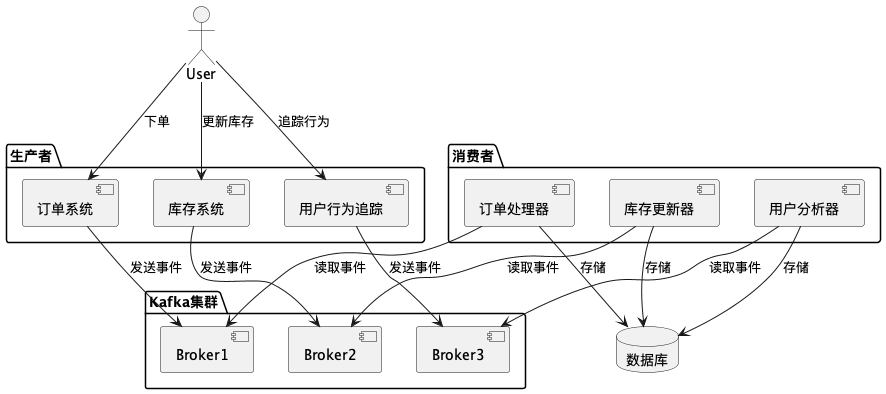

# 消息队列（MQ）完全指南

## 1. 什么是消息队列

消息队列（MessageQueue，MQ）是分布式系统中的重要组件。主要是用于解决**异步、解耦、削峰**等问题，通过高效可靠的消息传递机制进行平台无关的数据交流，可以在分布式环境下扩展进程间的通信，基于数据通信来进行分布式系统的集成，以实现高性能、高可用、可伸缩和最终一致性架构。

使用队列最常见的场景就是**生产者/消费者模式**：生产者生产消息放到队列中，消费者从队列里面获取消息消费。典型架构如下图所示：

## 2. 消息队列的作用

### 2.1 异步

**举例**：快递员发快递，一定要找到客户面对面送货效率会很低。引用快递驿站后，快递员只需要把快递放到驿站，就可以继续发其他快递去了，客户自行安排时间去驿站取快递。

**作用**：**异步能提高系统的响应速度、吞吐量**。

> 也可以使用 Future 实现（Java 中）

### 2.2 解耦

**举例**：快递员发快递，一定要找到客户面对面送货就一定要等到双方都有空才能完成投递操作，既依赖于用户是否有时间，也依赖于快递员是否有时间。引用快递驿站后，快递员只需要把快递放到驿站，就可以继续发其他快递去了，客户自行安排时间去驿站取快递。

**作用**：
- 服务之间进行解耦，才可以**减少服务之间的影响，提高系统整体的稳定性以及可扩展性**。
- 另外，解耦后可以实现数据分发。生产者发送一个消息后，可以由一个或者多个消费者进行消费，并且消费者的增加或者减少对生产者没有影响。

### 2.3 削峰

**举例**：虽然长江每年都会涨水，但是下游出水口的速度是基本稳定的，就是因为引入大坝后，可以把水储存起来，下游慢慢排水。

**作用**：**以稳定的系统资源应对突发的流量冲击**（以免系统崩溃，避免使用限流的方式先把数据圈住）

## 3. 消息队列通信协议

由于消息队列执行的是跨应用的信息传递，所以制定底层通信标准非常必要。目前主流的消息队列通信协议标准包括：

- **AMQP** (Advanced Message Queuing Protocol)：通用协议，IBM 公司研发
- **JMS** (Java Message Service)：专门为 Java 语言服务，SUN 公司研发，一组由 Java 接口组成的 Java 标准

## 4. 消息队列的选型

### 4.1 主流消息队列产品对比

| 特性 | RabbitMQ | ActiveMQ | RocketMQ | Kafka |
| --- | --- | --- | --- | --- |
| 研发团队 | Rabbit(公司) | Apache(社区) | 阿里(公司) | Apache(社区) |
| 开发语言 | Erlang | Java | Java | Scala & Java |
| 核心机制 | 基于 AMQP 的消息队列模型，使用生产者-消费者模式 | 基于 JMS 的消息传递模型，支持点对点和发布-订阅 | 分布式消息队列，采用主题(Topic)和标签(Tag)方式 | 分布式流平台，通过发布-订阅模型处理 |
| 协议支持 | XMPP STOMP SMTP | XMPP STOMP OpenWire REST | 自定义协议 | 自定义协议 + HTTP |
| 客户端支持语言 | 官方支持多种语言 | Java C/C++ Python PHP 等 | Java C++ | 官方支持 Java，社区支持多种 |
| 可用性 | 镜像队列 | 主从复制 | 主从复制 | 分区和副本 |
| 单机吞吐量 | 每秒十万左右级别 | 每秒数万级 | 每秒十万+级 | 每秒百万级 |
| 消息延迟 | 微秒级 | 毫秒级 | 毫秒级 | 毫秒以内 |
| 功能特性 | 并发能力强，性能极好，延时低 | 老牌产品，成熟度高 | MQ 功能完备，扩展性佳 | 专为大数据领域服务 |

## 5. Kafka 详解

### 5.1 Kafka 架构

Kafka 的核心组件包括：

- **Producer**：生产者，负责将消息投递到 Kafka 中。
- **Consumer**：消费者，通过拉的方式获取消息进行业务处理。
- **Broker**：一个独立的 Kafka 服务节点或实例，多个 Broker 组成 Kafka 集群。

Kafka 通过 ZooKeeper 来进行元数据管理，包括：集群、Broker、主题和分区等。

### 5.2 主题和分区

- **主题（Topic）**：是一类消息的集合。
- **分区（Partition）**：每个主题被分成多个分区，每个 Partition 在存储层面是 Append Log 文件。
- **偏移量（Offset）**：消息在分区中的位置称为偏移量，它唯一标记分区内的一条消息。

以用户订单、库存更新以及用户行为三个主题为基础的Kafka系统架构：

### 5.3 消息的顺序性

Kafka 通过分区机制保证消息的顺序性：

1. 消息在分区内按照发送顺序存储。
2. 消费者顺序读取分区内的消息。
3. 使用消息键（如订单 ID）确保相关消息发送到同一分区。

**消息发送**：
- 生产者发送订单事件A和B到分区1
- 生产者发送订单事件C到分区2
- 生产者发送订单事件D到分区3

**消息读取**：
- 消费者从分区1顺序读取订单事件A和B
- 消费者从分区2读取订单事件C
- 消费者从分区3读取订单事件D

### 5.4 消息的可靠性

#### 副本机制

- **分区副本**：每个分区可以有多个副本，分布在不同的 Broker 上。副本机制确保即使某个 Broker 发生故障，数据仍然可以从其他副本中恢复。
- **领导者副本**：每个分区有一个领导者副本（Leader Replica），负责处理所有的读写请求。其他副本称为追随者副本（Follower Replicas），负责复制领导者的更新。
- **故障恢复**：如果领导者副本所在的 Broker 发生故障，Kafka 会自动选举一个新的领导者副本，从而保证数据的可用性。

**副本机制的优势**：
- 高可用性：即使一个Broker宕机，其他副本仍可继续服务
- 数据安全：消息在多个副本上持久化
- 自动故障转移：Leader宕机时自动选举新Leader

#### 消息确认机制

生产者可以配置消息发送的确认级别（acknowledgment level），以确保消息在至少一个副本上被成功写入：

- **acks=0**：生产者不等待任何确认，消息可能会丢失。
- **acks=1**：生产者等待领导者副本的确认。
- **acks=all**：生产者等待所有副本的确认，确保最高的可靠性。

#### 持久性机制

- **日志存储**：Kafka 将消息持久化到磁盘上的日志文件中，确保数据的持久性。
- **刷盘机制**：Kafka 可以配置为定期将数据从页缓存刷到磁盘，以确保数据的持久性。这通常通过参数 `log.flush.interval.messages` 和 `log.flush.interval.ms` 进行控制。

> **注意**：Kafka 的刷盘机制是**异步刷盘**

## 6. RabbitMQ 详解

### 6.1 消息的顺序性

RabbitMQ 通过队列机制保证消息的顺序性：

- **队列内顺序**：消息在同一个队列**（先进先出（FIFO））**中按照发送顺序存储。
- **消费者顺序读取**：消费者按队列内的顺序依次读取消息。
- **单队列单消费者**：如果需要严格顺序，通常保证一个队列只有一个消费者（或者使用单线程消费）。

> **注意**：RabbitMQ 如果一个队列有多个消费者并发消费，无法保证全局顺序，只能保证单消费者的消费顺序。
>
> RabbitMQ 是通过 FIFO 来保证单消费者的顺序性，缺点是无法跳过最开始的值读后续的值，比如队列里原先有 A1 和 A2，必须先读 A1 再读 A2

### 6.2 消息的可靠性

#### 1. 持久化机制

- **队列持久化**：创建队列时设置 `durable=true`，保证队列元数据在 Broker 重启后仍存在。
- **消息持久化**：发送消息时设置 `delivery_mode=2`（持久化模式），确保消息写入磁盘。
- **刷盘机制**：RabbitMQ 会将持久化消息写入磁盘文件，确保即使 Broker 宕机，重启后仍能恢复。

> **注意**：RabbitMQ 的刷盘机制是**同步刷盘**，只有写入磁盘后才会返回 ACK

#### 2. 镜像队列 / 仲裁队列机制

- **镜像队列**：队列内容在多个节点之间实时同步，主节点宕机时，备节点自动接管，保证消息不丢失。
- **仲裁队列**：基于 Raft 协议的多副本队列，保证数据一致性和高可用性。

#### 3. 消息确认机制

- **生产端确认**（Publisher Confirm）：生产者在发送消息后等待 RabbitMQ 返回 ACK，确认消息已进入队列。
- **消费端确认**（Consumer ACK）：消费者处理完消息后发送 ACK，RabbitMQ 才会删除该消息。
- **NACK/Reject**：消费者可以拒绝消息并选择是否重新入队。

#### 4. 死信队列（DLX）

当消息被拒绝（nack/reject）、过期或超过最大重试次数时，会被路由到死信队列。死信队列用于存储无法正常处理的消息，便于后续人工排查或补偿。

## 7. 总结

消息队列是构建高性能、高可用分布式系统的关键组件。选择合适的消息队列产品需要根据具体的业务场景考虑：

- **Kafka**：适合高吞吐量、大数据处理场景
- **RabbitMQ**：适合对可靠性要求高、功能完整的场景
- **RocketMQ**：适合阿里系生态、功能完备的场景
- **ActiveMQ**：适合传统 Java 应用、成熟度高的场景

理解消息队列的核心概念和各产品的特性，能够帮助我们在实际项目中做出更好的技术选择。
