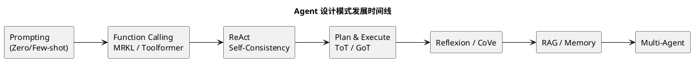

# Agent 设计模式演进

随着 Agent 技术的兴起以及作为 Codex 和 Claude Code 的重度用户，我觉得有必要对 Agent 的设计思路演进和底层实现进行深入了解。本文系统梳理了主流 Agent 设计模式，从单体推理到多 Agent 协作，帮助理解 Agent 架构的发展脉络。

## 技术分类说明

本文介绍的 Agent 设计模式可以分为三大类，理解这些分类有助于把握技术演进的本质：

### 1️⃣ 提示词工程（Prompt Engineering）

**特征**：纯 Prompt 技术，任何 LLM 都能使用，无需修改模型

**代表技术**：
- Zero/Few-shot Prompting
- Chain-of-Thought (CoT)
- Self-Consistency
- ReAct（作为 Prompt 模式）
- Plan & Execute
- Self-Refine
- Chain-of-Verification (CoVe)
- Reflexion（Prompt + 外部存储）

**实现方式**：通过精心设计的 Prompt 模板和多轮对话实现

### 2️⃣ 模型架构演进（Model Evolution）

**特征**：需要模型微调、训练方法改进或新的训练数据

**代表技术**：
- Function Calling（Schema-driven，需模型微调）
- Toolformer（自监督学习，需重新训练）
- RLHF（强化学习人类反馈，训练方法）

**实现方式**：通过修改模型权重或训练流程实现

**重要里程碑**：
- 2023：OpenAI Functions API、Anthropic Tool Use（Function Calling 成为行业标准）
- 2024：OpenAI o1（深度推理能力训练进模型）

### 3️⃣ 系统架构模式（System Patterns）

**特征**：由外层框架实现的系统设计，组合多个模型调用或外部系统

**代表技术**：
- Tool Use（工具调用闭环）
- MRKL（路由 + 专家系统）
- RAG（检索增强生成）
- Multi-Agent（多智能体协作）
- Tree/Graph of Thoughts（搜索算法 + LLM）
- Generative Agents（记忆流系统）

**实现方式**：通过 LangChain、AutoGPT 等框架实现

### 🔄 技术演进规律

**提示词工程 → 模型架构演进**

许多成功的 Prompt 技术最终会被"训练进"模型：

```
CoT（2022，Prompt）
  ↓ 启发
模型训练融入推理步骤（2023+）
  ↓ 演进
OpenAI o1（2024，深度推理模型）

Few-shot（2020，Prompt）
  ↓ 启发
Function Calling（2023，模型微调）

ReAct（2022，Prompt 模式）
  ↓ 影响
Agent 训练数据（2023+）
```

**关键洞察**：
- **Prompt 技术**证明了"这种能力有用"
- **模型演进**让这种能力变得"更可靠、更高效"
- **框架模式**将能力组合成"可落地的系统"

### 🗺️ 核心技术演进路径图

```
Few-shot (#2)
  ↓ 启发格式控制
Function Calling (#3) ⚠️ 模型微调里程碑
  ↓ 提供能力
Tool Use (#4)
  ↓ 结合 CoT
ReAct (#9)

---

CoT (#7) 🌟 多个技术的源头
  ├→ Self-Consistency (#8)
  ├→ Plan & Execute (#10)
  ├→ ToT (#11) → GoT (#12)
  └→ 影响模型训练 → OpenAI o1

---

Tool Use (#4) + ReAct (#9)
  ↓ 基础
Multi-Agent (#17-19)
RAG + ReAct → Agentic RAG (#20)
```

**图例**：
- `→` 直接影响/演进
- `├→` 分支影响
- `⚠️` 关键里程碑
- `🌟` 核心源头技术

---

## 1. 发展时间线（PlantUML）

图中主轴表示 Agent 设计模式的演进路径，从基础的工具调用到规划执行、反思改进，再到多 Agent 协作。

这条发展路径可以理解为：先解决“能调用工具”的能力（Function Calling），再进入“能规划并执行”的阶段（ReAct、Plan & Execute），随后通过反思与搜索增强可靠性（Reflexion、ToT），最终演进为多 Agent 编排与协作（Multi-Agent Orchestrator）。



## 2. 主流 Agent 设计模式清单

### 第一阶段：提示与工具调用 (Prompting & Tool Use)

#### 1. Zero-shot Prompting (零样本提示)

**🏷️ 技术分类**：提示词工程（Prompt Engineering）

- **背景 (Background)**：
  随着大模型规模的扩大（GPT-3 的 1750 亿参数），研究者发现了一个惊人现象：模型在未见过的任务上也能表现出色。这种**涌现能力 (Emergent Ability)** 的发现，让人们意识到大规模预训练带来的不仅是知识记忆，更是强大的泛化能力。
- **概念与机制 (Concept & Mechanism)**：
  依靠模型在大规模预训练中内化的知识和推理模式来生成回答。它本质上是"指令遵循 (Instruction Following)"，即模型仅凭对自然语言指令的理解就能执行从未训练过的任务。
  - **机制**：Prompt -> Tokenizer -> Transformer Model -> Output Probabilities -> Decoding（解码策略如 Greedy、Top-p Sampling 等，将概率分布转换为最终文本）。
- **示例 (Example 翻译任务)**：

  ```text
  [Instruction]:
  将以下中文句子翻译成英文，并保持正式商务语气。

  [Input]:
  我们在收到贵方付款后会立即发货。

  [Output]:
  We will ship the goods immediately upon receipt of your payment.
  ```

- **作用与优势 (Advantage)**：
  - **知识迁移 (Knowledge Transfer)**：模型在预训练阶段学习了海量的通用知识（如语言逻辑、世界常识、代码语法），能够将这些知识**迁移**到从未见过的具体任务中。例如，GPT-4 虽然没有专门训练过“写一个 Python 爬虫来抓取特定网页”，但它能将“Python 语法知识”与“HTTP 协议知识”组合，完成这个新任务。
  - **涌现能力 (Emergent Abilities)**：随着模型规模增大，Zero-shot 能力会突然显著提升，使其能处理训练数据中未明确包含的复杂指令。
  - **便捷性**：用户使用门槛最低，无需准备数据。

#### 2. Few-shot Prompting (少样本提示 / ICL)

**🏷️ 技术分类**：提示词工程（Prompt Engineering）

**📍 演进影响**：
- **→ 启发了 Function Calling** (#3)：Few-shot 证明了"通过示例控制输出格式"的可行性，为后续的工具调用铺路

- **背景 (Background)**：
  GPT-3 论文中揭示了一个革命性发现：**In-Context Learning (ICL)**——模型能够从 Prompt 中的示例直接学习，无需更新权重。这打破了传统机器学习"必须通过训练更新参数才能学习"的范式，展示了 Transformer 模型惊人的模式识别和迁移能力。
- **概念 (Concept)**：
  在提示词中提供少量（通常 1-5 个）高质量"输入-输出"对作为示例（Demonstrations），让模型通过上下文中的模式推理来处理新输入。这不是记忆，而是实时的模式匹配和泛化。
- **示例 (Example)**：

  ```text
  任务：将水果归类并提取颜色。

  示例1：
  输入：Apple
  输出：{"category": "fruit", "color": "red"}

  示例2：
  输入：Spinach
  输出：{"category": "vegetable", "color": "green"}

  // 待处理
  输入：Sky
  输出：
  ```

- **对比 (VS Zero-shot)**：
  - **Zero-shot**：更依赖模型自身的智商（Parametric Knowledge）。
  - **Few-shot**：更依赖 Prompt 的设计（Context Knowledge）。对于复杂、非标任务，Few-shot 完胜。

- **作用与优势 (Advantage)**：
  - **激活潜在能力**：Few-shot 是激发大模型**潜在能力**的关键。它不仅规范了输出格式，更重要的是通过示例激活了模型内部对特定任务的理解，能够在不进行微调的情况下，让模型表现出接近微调的效果。
  - **早期工具调用的基础**：在 Schema-driven Function Calling 出现之前（2023），研究者通过 Few-shot 示例来引导模型输出结构化格式（如 JSON）。例如早期的 ReAct 论文（2022）就是在 Prompt 中提供 "Thought-Action-Observation" 格式的示例，让模型学会按这个模式输出。虽然这种方法不如后来的微调稳定，但它证明了"通过示例控制输出格式"的可行性，为后续的工具调用模式奠定了基础。

#### 3. Function Calling (函数调用)

**🏷️ 技术分类**：模型架构演进（Model Evolution）⚠️ 关键里程碑

**📍 技术依赖与影响**：
- **← 受 Few-shot 启发** (#2)：早期通过 Few-shot 示例引导 JSON 输出，后演进为模型微调
- **→ 奠定了 Tool Use 基础** (#4)：模型具备输出结构化指令的能力后，框架才能实现工具调用闭环
- **→ 使 ReAct 成为可能** (#9)：ReAct 需要模型能够输出结构化的 Action

- **背景 (Background)**：
  LLM 本身是一个**封闭的文本生成系统**，无法直接与外部世界交互（调用 API、读取文件、访问数据库、获取实时信息等）。为了突破这一根本限制，赋予 LLM "行动能力"，需要让它能够：① 识别何时需要外部工具，② 输出结构化的工具调用指令（通常是 JSON 格式），③ 接收工具执行结果并继续推理。

- **发展历程 (Evolution)**：
  Function Calling 经历了两个阶段的演进：

  **阶段一：Prompt-based Function Calling (2022 早期)**
  - 通过精心设计的 Prompt 指导模型输出 JSON 格式
  - 示例：在 Prompt 中明确说明 "如果需要调用工具，请输出：`{\"tool\": \"tool_name\", \"args\": {...}}`"
  - 缺点：格式不稳定，容易出现多余文本或格式错误，需要复杂的后处理和错误恢复逻辑

  **阶段二：Schema-driven Function Calling (2023 至今)**
  - OpenAI、Anthropic 等通过特定微调，让模型原生支持 Function Calling
  - 提供 **Function Schema**（OpenAPI、JSON Schema），模型自动识别并严格按 Schema 输出
  - 优势：格式可靠、类型安全、支持复杂参数验证
  - 代表：OpenAI Functions/Tools API、Anthropic Tool Use、Claude Tool Use

- **概念 (Concept)**：
  一种让模型能够识别何时需要调用外部函数，并输出符合预定义 Schema 的**结构化 JSON 对象**（包含函数名和参数）的能力。现代实现通常通过模型微调实现，而非纯 Prompt 工程。

- **示例 (Example - Schema-driven)**：

  ```json
  // 预定义 Schema:
  {
    "name": "send_email",
    "parameters": {
      "type": "object",
      "properties": {
        "recipient": {"type": "string"},
        "body": {"type": "string"}
      },
      "required": ["recipient", "body"]
    }
  }

  // User: "Send an email to Bob saying Hi"

  // Model Output (Function Call):
  {
    "tool": "send_email",
    "parameters": {
      "recipient": "bob@example.com",
      "body": "Hi"
    }
  }
  ```

- **作用与优势 (Advantage)**：
  - **Agent 的基石**：Function Calling 是所有现代 Agent 的地基。它将 LLM 从一个单纯的"聊天机器"转变为一个可以与数字世界交互的"系统组件"。没有它，后续的 ReAct、Planning 都无从谈起。
  - **确定性与安全性**：将模糊的自然语言意图转换为确定的 API 调用，使得开发人员可以在系统层面对模型的行为进行拦截、校验和权限控制。Schema 验证进一步增强了类型安全。

#### 4. Tool Use (工具使用)

**🏷️ 技术分类**：系统架构模式（System Pattern）

**📍 技术依赖**：
- **← 依赖 Function Calling** (#3)：需要模型具备输出结构化工具调用的能力
- **→ 为 ReAct 提供执行能力** (#9)：Tool Use 提供了工具执行闭环，ReAct 提供了推理模式

- **背景 (Background)**：
  有了 Function Calling 的能力（模型能输出结构化的工具调用指令），下一步是构建完整的系统来真正执行这些工具并将结果反馈给模型，形成闭环。这需要 Agent Framework 的支持。
- **概念与机制 (Concept & Mechanism)**：
  这是一个完整的**系统级交互闭环（Agentic Loop）**，通常由 Agent Framework（如 LangChain, AutoGen）实现：
  1.  **Generation**：LLM 生成工具调用（JSON），暂停文本生成。
  2.  **Execution**：Framework 拦截调用，在真实环境中执行（调用 API、运行代码等）。
  3.  **Observation**：系统将执行结果封装为新的 Message（role='tool'），追加到对话历史。
  4.  **Resumption**：LLM 接收工具结果，基于新信息继续推理或生成最终回答。
- **示例 (Example 完整交互流)**：

  ```text
  [User]: "计算 123 * 456"

  [Model]: (生成 Tool Call)
  { "tool": "calculator", "args": "123 * 456" }
  -- 停止生成 (Stop) --

  [System]: (执行 Python eval)
  return 56088

  [Model] (看到 Tool Result):
  "计算结果是 56,088。"
  ```

- **对比 (VS Function Calling)**：
  - **Function Calling**：是 **Capability (能力)**，指模型会说话变成 JSON。
  - **Tool Use**：是 **Pattern (模式)**，指系统利用这种能力真正去干活。前者是后者的基础。

- **作用与优势 (Advantage)**：
  - **能力接地 (Grounding)**：通过实时访问外部信息，Tool Use 解决了 LLM 最大的两个弱点：知识截止（过时）和幻觉（瞎编）。它让 Agent 的回答建立在事实而非概率预测之上。
  - **ReAct 的前置**：Tool Use 是 ReAct 模式的一半（Acting 部分）。当模型学会使用工具后，再叠加推理能力，就诞生了真正的自主 Agent。

#### 5. MRKL (Modular Reasoning, Knowledge and Language)

**🏷️ 技术分类**：系统架构模式（System Pattern）

- **背景 (Background)**：
  在 2022 年前后，研究者意识到单一的 LLM 无法同时擅长所有领域。数学计算、事实查询、数据库操作等任务需要确定性系统（符号系统）的精确性，而 LLM 擅长的是语言理解和常识推理。如何将两者结合成为关键问题。
- **概念与机制 (Concept & Mechanism)**：
  MRKL 采用**Router (路由器)** 模式。系统包含一个前端 LLM（Router），它不直接回答问题，而是根据意图将 Query 转发给最合适的**专家模块**。专家模块可以是 API、数据库、数学引擎，甚至是另一个专门的 LLM。
- **示例 (Example 路由分发)**：

  ```text
  [User Input]: "What is the square root of 23459?"

  [Router LLM]:
  Thought: This is a math problem.
  Action: Delegate to [Calculator Module].

  [Calculator Module]:
  Result: 153.163

  [Router LLM]:
  Answer: The square root is approximately 153.16.
  ```

- **作用与优势 (Advantage)**：
  - **神经与符号的桥梁**：MRKL 完美结合了"神经概率模型"（LLM，擅长语言和常识）与"符号确定性系统"（Calculator/DB，擅长逻辑和事实）。
  - **多 Agent 的雏形**：MRKL 的"路由+专家"思想，实际上是后来 Multi-Agent Orchestrator 模式的早期原型，为复杂系统的分工协作指明了方向。
  - **历史地位**：作为 2022 年的早期探索，MRKL 的架构思想（模块化、专家分工）被后续的 Multi-Agent 系统继承，但其路由模式在工具调用场景被更简洁的 Function Calling 取代。

#### 6. Toolformer

**🏷️ 技术分类**：模型架构演进（Model Evolution）❌ 学术探索，未被工业界采用

- **背景 (Background)**：
  早期的工具调用方法需要大量人工标注"在什么情况下应该调用哪个工具"，成本高且难以扩展。Meta 研究者提出疑问：能否让模型通过自监督学习，自己发现何时需要工具，而不依赖人工标注？
- **概念与机制 (Concept & Mechanism)**：
  Toolformer 是一种**自监督学习 (Self-Supervised Learning)** 方法。它不依赖大量人工标注，而是让模型在预训练数据中尝试插入 API 调用，如果调用结果对预测下一个 token 有帮助（即降低了 Perplexity），就保留该 API 调用作为训练数据。最终模型学会了把 API 调用当作一种“语言”来生成。
- **示例 (Example 文本流式调用)**：

  ```text
  [Input]:
  "The Spanish flu, which was caused by the H1N1 influenza A virus, lasted from..."

  [Toolformer Generation]:
  "The Spanish flu, which was caused by the H1N1 influenza A virus, lasted from <API>WikiSearch('Spanish flu duration')</API> 1918 to 1920."

  (注意：API 调用和结果直接嵌入在文本流中，如同自然语言的一部分)
  ```

- **对比 (VS Function Calling)**：

  **核心区别：耦合 vs 解耦**

  | 维度 | Toolformer（紧耦合） | Function Calling（解耦） |
  |------|---------------------|-------------------------|
  | **模型需要学习** | ① 何时用工具<br>② 调用哪个工具<br>③ 工具实现逻辑（硬编码） | ① 何时用工具<br>② 理解 Schema<br>③ 输出 JSON |
  | **工具执行** | 嵌入模型权重 | 外部框架负责 |
  | **新增工具** | 需要重新训练模型 | 更新配置文件即可 |
  | **通用性** | 每个工具集需要独立训练 | 一个模型适用所有场景 |
  | **维护成本** | 高（工具变化需重训） | 低（只需更新外部实现） |
  | **用户自定义** | 不支持 | 支持（提供 Schema 即可） |

  **架构对比**：
  ```
  Toolformer（紧耦合）：
  ┌─────────────────────────┐
  │   LLM（权重中包含）      │
  │  推理 + 工具识别 + 执行  │  ← 全部耦合
  └─────────────────────────┘

  Function Calling（解耦）：
  ┌─────────────────────┐
  │   LLM（通用能力）    │
  │  推理 + Schema理解   │  ← 训练一次
  └──────────┬──────────┘
             │ 输出 JSON
             ↓
  ┌─────────────────────┐
  │  工具执行框架        │  ← 可扩展
  │  注册 + 执行 + 结果  │
  └─────────────────────┘
  ```

  **为什么解耦更通用**：
  - **训练成本**：Toolformer 每增加工具需重训，Function Calling 只训练一次"理解 Schema + 输出 JSON"的能力
  - **扩展性**：同一个 GPT-4/Claude 模型，通过不同 Schema 配置支持无限工具
  - **维护性**：工具 API 升级（如 v1 → v2）时，Toolformer 需重训，Function Calling 只需更新 Schema

- **历史地位 (Historical Status)**：
  - **学术价值**：Toolformer 证明了自监督学习工具使用的可行性，是重要的学术探索。
  - **工程实践**：2023 年后，Schema-driven Function Calling 因其灵活性和可靠性成为行业标准（OpenAI Functions API、Anthropic Tool Use），Toolformer 的方法基本未被工业界采用。
  - **影响**：它的"模型自主决策何时使用工具"的思想，被吸收进了现代 Function Calling 系统中。

---

### 第二阶段：推理与规划 (Reasoning & Planning)

#### 7. Chain-of-Thought (CoT)

**🏷️ 技术分类**：提示词工程（Prompt Engineering）→ 影响模型训练

**📍 演进影响**（CoT 是多个技术的源头）：
- **→ 催生了 Self-Consistency** (#8)：在 CoT 基础上增加多路径采样和投票
- **→ 启发了 Plan & Execute** (#10)：CoT 的"分步思考"演进为"先规划后执行"
- **→ 推动了 ToT/GoT** (#11, #12)：将线性 CoT 扩展为树/图搜索
- **→ 影响了模型训练**：现代模型（如 OpenAI o1）在训练时融入推理步骤能力

- **背景 (Background)**：
  Google 研究者在测试 LLM 的数学能力时发现，直接要求答案的正确率很低，但如果加一句"Let's think step by step"，准确率会显著提升。这揭示了一个重要现象：**中间推理步骤的可视化能够激活模型的深层推理能力**。
- **概念 (Concept)**：
  一种提示工程技术，要求模型在给出最终答案之前，先显式地生成**中间推理步骤**。即 "Let's think step by step"。
- **示例 (Example - 对比效果)**：

  ```text
  Q: 迈克尔有5个苹果，吃了2个，买来3个。现在几个？

  ❌ Zero-shot（直接回答）:
  A: 8 个。
  (错误：模型直觉性地加了所有数字 5+2+3=10，或其他错误推理)

  ✅ CoT（显式推理步骤）:
  A: 让我一步步分析：
  1. 起始有 5 个苹果。
  2. 吃了 2 个，剩余：5 - 2 = 3 个。
  3. 又买来 3 个，总共：3 + 3 = 6 个。
  答案是 6 个苹果。

  结果：准确率显著提升（研究显示在复杂推理任务上可提升 30-50%）
  ```

- **对比 (VS Zero-shot)**：
  - **CoT**：用更多的 Token 换取更高的准确率（System 2）。
  - **Zero-shot**：直觉反应（System 1）。

- **作用与优势 (Advantage)**：
  - **解锁 System 2 思维**：CoT 是大模型能力涌现的典型代表。它让模型学会了“慢思考”，是处理复杂任务的必经之路。
  - **规划能力的源头**：CoT 是所有高级 Planning 模式（ReAct, ToT, Plan & Execute）的**核心原语**。没有 CoT 的“分步思考”能力，Agent 就无法生成有效的行动计划。

#### 8. Self-Consistency (CoT-SC)

**🏷️ 技术分类**：提示词工程（Prompt Engineering）+ 采样策略

**📍 技术依赖**：
- **← 基于 CoT** (#7)：在 CoT 基础上增加多路径采样和多数投票机制

- **背景 (Background)**：
  单次 CoT 推理路径具有随机性和脆弱性——可能中间某一步出错导致全盘皆输。Google 研究者受集成学习启发提出：如果让模型生成多条独立的推理路径，然后通过投票选择最一致的答案，是否能提升可靠性？
- **概念与机制 (Concept & Mechanism)**：
  基于**Ensemble Learning (集成学习)** 思想。
  1.  **多路径采样**：设置 **Temperature > 0**（如 0.7），让模型对同一 Prompt 生成 k 条不同的 CoT 推理路径。
      - **关键参数**：`temperature=0.7`（产生多样性，若为 0 则每次结果相同）
      - **辅助参数**：`top_p=0.95`（可选，用于质量控制）
      - **采样次数**：通常 5-40 次
  2.  **答案归一化**：提取每条路径的最终答案。
  3.  **多数投票**：选择出现频率最高的答案作为最终结果。
- **示例 (Example - 对比效果)**：

  ```text
  Q: 昨天的明天的后天是星期几？（假设今天是周一）

  ❌ 单次 CoT（容易出错）:
  昨天周日 -> 明天周二 -> 后天周三
  答案：周三 ✗（推理中间某步出错）

  ✅ Self-Consistency（多路径投票）:

  Sample 1: 昨天周日 → 明天周一 → 后天周二 → Ans: 周二
  Sample 2: 昨天周日 → 明天周二(错) → 后天周三 → Ans: 周三
  Sample 3: 昨天周日 → 明天周一 → 后天周二 → Ans: 周二
  Sample 4: 昨天周日 → 明天周一 → 后天周二 → Ans: 周二
  Sample 5: 昨天周日 → 明天周二(错) → 后天周三 → Ans: 周三

  投票结果：
  - 周二: 3 票 ✓（正确答案胜出）
  - 周三: 2 票

  最终答案：周二 ✓

  效果：通过多数投票过滤掉偶然错误，准确率提升 10-20%
  ```

- **作用与优势 (Advantage)**：
  - **决策鲁棒性**：在 Agent 做关键决策（如删除文件、资金转账）时，Self-Consistency 提供了必要的“安全确认”机制。
  - **提升 CoT 上限**：它证明了简单的多次采样策略可以显著突破单个模型的智力天花板，为后续的思维树（ToT）搜索奠定了理论基础。

#### 9. ReAct (Reasoning + Acting)

**🏷️ 技术分类**：提示词工程（Prompt Engineering）→ 影响 Agent 训练

**📍 技术依赖与影响**：
- **← 结合了 CoT + Tool Use** (#7 + #4)：将 CoT 的推理能力与 Tool Use 的执行能力融合
- **→ 影响了 Agent 训练**：ReAct 格式成为 Agent 微调的重要训练数据
- **→ 对比 Plan & Execute** (#10)：ReAct 是动态决策，Plan & Execute 是静态规划

**演进影响**：ReAct 作为 Prompt 模式被广泛采用后，成为 Agent 微调的重要训练数据格式。

- **背景 (Background)**：
  CoT 擅长内部推理，Tool Use 实现了外部交互，但两者是割裂的。对于需要"边思考边行动"的复杂任务（如调试代码、多步信息收集），需要将推理和行动融合成一个统一的循环。
- **概念 (Concept)**：
  **ReAct = Reason + Act**。这是一种 Prompt 模式，要求模型交替进行：
  - **Thought (思考)**：分析当前状态，决定下一步策略
  - **Action (动作)**：调用工具或执行操作
  - **Observation (观察)**：接收工具返回的结果

  然后基于观察结果进行下一轮 Thought，形成动态决策循环，直到任务完成。

- **示例 (Example - 对比效果)**：

  **任务**：查找服务器故障原因

  ```text
  ❌ 纯 CoT（只能猜测，无法验证）:
  Thought: 服务器可能是内存不足导致的崩溃。
  → 无法验证，只能靠猜测

  ✅ ReAct（思考 + 行动 + 观察）:

  Thought 1: 我需要先获取服务器的 IP 地址。
  Action 1: get_server_ip(name="prod-web-01")
  Observation 1: 192.168.1.10

  Thought 2: 现在连接服务器查看系统日志。
  Action 2: ssh_and_read_log("192.168.1.10", "/var/log/syslog")
  Observation 2: "Out of memory: Kill process 1234..."

  Thought 3: 确认是内存问题。检查哪个进程占用最多内存。
  Action 3: ssh_run_command("192.168.1.10", "ps aux --sort=-%mem | head -5")
  Observation 3: "java process consuming 8GB RAM"

  Thought 4: 找到原因了。Java 进程内存泄漏导致 OOM。
  Final Answer: 服务器因 Java 应用内存泄漏（8GB）触发 OOM Killer 而崩溃。

  效果：通过动态交互获取真实信息，而非凭空推理
  ```

- **对比 (VS CoT)**：
  - **CoT**：只是在脑子里想（Internal Reasoning）。
  - **ReAct**：不仅想，还动手（Reasoning + Acting）。ReAct 是 CoT 加了手和脚。

- **作用与优势 (Advantage)**：
  - **自主性的里程碑**：ReAct 标志着 LLM 从“被动问答”真正走向了“自主解决问题”。它是第一个真正的 **Agentic Pattern**。
  - **动态纠错**：相比纯 Plan，ReAct 能够在执行中发现错误并即时修正（"Thought: 这个方法不行，我换一个"）。这种灵活性是应对现实世界不确定性的关键。

#### 10. Plan & Execute (Plan-and-Solve)

**🏷️ 技术分类**：提示词工程（Prompt Engineering）

**📍 技术依赖**：
- **← 源自 CoT** (#7)：将 CoT 的"分步思考"演进为"先规划后执行"的两阶段模式
- **↔ 对比 ReAct** (#9)：解决 ReAct 在长链路任务中容易迷失方向的问题

- **背景 (Background)**：
  ReAct 的"走一步看一步"策略在复杂长链路任务中暴露问题：容易迷失方向、陷入死循环、或在局部细节上浪费大量 Token。研究者发现，人类处理复杂任务时会先制定计划，这启发了"先规划后执行"的分阶段模式。
- **概念 (Concept)**：
  将任务分为**Planner (规划)** 和 **Executor (执行)** 两个阶段。先生成完整的 Todo List，再按顺序逐个执行。
- **示例 (Example - 对比效果)**：

  **任务**：写一篇关于"AI Agent 发展史"的技术博客

  ```text
  ❌ ReAct（容易跑偏，在细节中迷失）:
  Thought: 先搜索一下什么是 Agent...
  Action: web_search("AI Agent definition")
  Observation: [大量结果]
  Thought: 我需要再细化一下，搜索 LangChain...
  Action: web_search("LangChain Agent")
  ... (20 轮后)
  Thought: 等等，我最初要写什么来着？😵

  ✅ Plan & Execute（全局规划，步骤清晰）:

  [Planning 阶段]:
  1. 搜索 AI Agent 发展里程碑事件（2020-2024）
  2. 整理时间线：ReAct、ToT、Multi-Agent
  3. 为每个模式搜索论文链接
  4. 撰写各模式介绍（背景、概念、示例）
  5. 添加对比表格和总结

  [Execution 阶段]:
  Step 1: web_search("AI Agent milestones 2020-2024") ✓
  Step 2: organize_timeline([ReAct, ToT, ...]) ✓
  Step 3: search_papers(["ReAct", "Tree of Thoughts"]) ✓
  Step 4: write_sections(...) ✓
  Step 5: add_comparison_table() ✓

  Done! 完整的博客已生成。

  效果：避免迷失方向，高效完成长链路任务
  ```

- **对比 (VS ReAct)**：

  | 维度           | ReAct                            | Plan & Execute               |
  | -------------- | -------------------------------- | ---------------------------- |
  | **决策方式**   | 动态决策，每步基于观察           | 静态规划，一次性生成全部步骤 |
  | **灵活性**     | 高（可随时调整）                 | 低（需重新规划）             |
  | **适用场景**   | 探索性任务、调试、需要反馈的任务 | 明确目标、步骤清晰的任务     |
  | **Token 消耗** | 中等（每步都要推理）             | 低（规划一次，执行简单）     |
  | **错误恢复**   | 强（即时纠错）                   | 弱（可能按错误计划执行）     |
  | **任务长度**   | 容易迷失（适合中短任务）         | 擅长长任务                   |

  **实际应用选择**：
  - **用 ReAct**：网页爬取、信息收集、代码调试、需要试错的任务
  - **用 Plan & Execute**：写报告、数据分析流程、软件开发（需求明确时）

- **作用与优势 (Advantage)**：
  - **处理长程任务**：解决了 ReAct 在长链路任务中容易"迷失方向"或"死循环"的问题。
  - **模块化解耦**：将"思考（Planning）"与"行动（Acting）"解耦，允许使用不同能力的模型（如强模型做规划，弱模型做执行），这为后续的层次化 Agent 设计提供了思路。

#### 11. Tree of Thoughts (ToT)

**🏷️ 技术分类**：系统架构模式（System Pattern）- 搜索算法 + LLM

**📍 技术依赖与影响**：
- **← 扩展了 CoT** (#7)：将线性 CoT 扩展为树状搜索，增加分支、回溯能力
- **→ 启发了 GoT** (#12)：树结构的限制催生了更灵活的图结构
- **→ 影响了深度推理模型**：ToT 的搜索思想影响了 OpenAI o1 的设计

- **背景 (Background)**：
  CoT 和 Plan & Execute 都是线性推理——一旦选择了某条路径就无法回溯。但许多问题（如数学证明、游戏决策、创意写作）需要探索多种可能性并能够"后悔"。研究者受搜索算法（如 AlphaGo 的 MCTS）启发，将推理过程建模为树结构，引入前瞻搜索和回溯能力。
- **概念与机制 (Concept & Mechanism)**：
  将推理过程建模为**树 (Tree)**，每个节点代表一个思维状态（Thought）。ToT 引入了经典的搜索算法（BFS/DFS）来探索解空间：
  1.  **思维分解 (Thought Decomposition)**：将大问题拆解为多个小步骤。
  2.  **思维生成 (Thought Generator)**：在当前步骤生成 k 个候选想法。
  3.  **状态评估 (State Evaluator)**：用 LLM 或启发式方法给每个想法打分或投票。
  4.  **搜索策略 (Search Algorithm)**：根据评分保留最有希望的路径（剪枝），或回溯到上一步重新探索。
- **示例 (Example 24点游戏)**：

  ```text
  任务：用 4, 9, 10, 13 算出 24。

  Step 1 (生成候选):
  - 想法 A: 13 - 9 = 4 (剩 4, 4, 10) -> 评估：难
  - 想法 B: 10 - 4 = 6 (剩 6, 9, 13) -> 评估：可能
  - 想法 C: 4 * 9 = 36 ... -> 评估：难

  Step 2 (从 B 扩展):
  - 想法 B1: 13 - 6 = 7 (剩 7, 9) -> 评估：不可行 (7, 9 无法算出 24) -> 剪枝/回溯
  - ... (继续搜索其他路径)

  Step N (找到解):
  (13 - 4) / 9 * 24 ? No.
  ...
  Final Path: (10 - 4) * (13 - 9) = 6 * 4 = 24.
  ```

- **作用与优势 (Advantage)**：
  - **战略级搜索**：ToT 将“搜索算法”引入了“语言生成”，让 Agent 具备了前瞻性和全局规划能力。它是解决高难度推理问题（如数学证明、代码架构设计）的必备模式。
  - **为 AlphaZero 范式铺路**：ToT 展示了通过搜索和评估提升性能的可能性，这被认为是通往 System 2 Deep Thinking（如 OpenAI o1）的关键路径。

#### 12. Graph of Thoughts (GoT)

**🏷️ 技术分类**：系统架构模式（System Pattern）- 图搜索 + LLM

**📍 技术依赖**：
- **← 扩展了 ToT** (#11)：突破树结构限制，支持节点合并和循环

- **背景 (Background)**：
  ToT 虽然支持分支和回溯，但仍局限于树结构——思维只能向前分叉，不能合并或循环。但人类思维更复杂：可以将多个想法聚合（Aggregation）、可以迭代优化（Loop）。研究者提出用有向图（DAG）来建模更灵活的思维流。
- **概念与机制 (Concept & Mechanism)**：
  将推理过程建模为**有向图 (DAG)**，即 Thinking Graph。相比 ToT，GoT 增加了更灵活的操作：
  1.  **聚合 (Aggregation)**：将多个思维节点的信息合并为一个新节点（类似 MapReduce 的 Reduce）。
  2.  **循环 (Loop)**：允许思维回到之前的状态进行迭代优化。
  3.  **分叉 (Branching)**：从一个思维点发散出多个方向。
      这使得 Agent 能够模拟“头脑风暴 -> 归纳总结 -> 再发散”的复杂人类思维模式。
- **示例 (Example 文档摘要)**：

  ```text
  任务：总结三篇新闻的共同点。

  节点 1, 2, 3: 分别生成 News A, B, C 的摘要。
  节点 4 (Aggregation): 寻找 1, 2, 3 的共同关键词 -> "经济衰退", "通胀"。
  节点 5 (Refinement): 基于共同点，重新审视 News A，提取更详细的通胀数据。
  节点 6 (Output): 生成最终综合报告。

  Graph: (1,2,3) -> 4 -> 5 -> 6
  ```

- **对比 (VS ToT)**：

  | 维度         | Tree of Thoughts (ToT)     | Graph of Thoughts (GoT)  |
  | ------------ | -------------------------- | ------------------------ |
  | **结构**     | 树（Tree）                 | 有向图（DAG）            |
  | **操作**     | 分叉、剪枝、回溯           | 分叉、合并、循环、回溯   |
  | **信息流**   | 单向（父→子）              | 多向（可合并多个源）     |
  | **适用场景** | 探索决策树、游戏、数学证明 | 多源信息整合、迭代优化   |
  | **复杂度**   | 中等                       | 高                       |
  | **实现难度** | 较容易                     | 较困难（需要图执行引擎） |

  **核心差异**：
  - **ToT**：像下棋一样探索路径，不能将多条路径的结果合并
  - **GoT**：像头脑风暴一样，可以从多个角度思考后归纳总结

- **作用与优势 (Advantage)**：
  - **突破线性束缚**：人类的思维是非线性的，GoT 首次让 Agent 的推理结构能够逼近人类的复杂思维网络。
  - **多源信息综合**：在需要整合来自不同来源、不同时间点的碎片信息时（如情报分析），图结构的优势无可替代。

#### 13. Skeleton-of-Thought (SoT)

**🏷️ 技术分类**：系统架构模式（System Pattern）- 并行生成优化

- **背景 (Background)**：
  LLM 的自回归生成（Auto-regressive Generation）是严格串行的——必须生成完第 N 个词才能生成第 N+1 个词。这导致生成长文本时延迟高、用户体验差。研究者受人类写作流程（先列提纲再填充细节）启发，提出将生成过程拆解为并行任务，从而加速输出。
- **概念与机制 (Concept & Mechanism)**：
  受人类写作习惯（先列提纲再写内容）启发，旨在解决 LLM 串行生成速度慢的问题。
  1.  **Skeleton Stage**：提示模型仅生成一篇文章的“骨架”（Bullet Points 或 标题）。
  2.  **Point-Expansion Stage**：将骨架中的每个 Point 分别作为 Prompt 发送给 LLM，**并行**请求扩展内容。
  3.  **Merge Stage**：将所有并行生成的内容按顺序拼接。
- **示例 (Example 并行写书)**：

  ```text
  User: 写一本关于“如何养猫”的手册。

  Step 1 (Skeleton):
  1. 准备工作
  2. 饮食指南
  3. 疾病预防

  Step 2 (Parallel Expansion):
  - Thread A: Expand "准备工作" -> "猫砂盆, 猫粮..."
  - Thread B: Expand "饮食指南" -> "干粮 vs 湿粮..."
  - Thread C: Expand "疾病预防" -> "疫苗, 驱虫..."

  Step 3 (Merge): A + B + C = 完整手册。
  ```

- **作用与优势 (Advantage)**：
  - **工程化极致**：SoT 更多是一种工程上的优化，它展示了如何通过打破“自回归生成”的串行限制来换取时间和用户体验。
  - **并行思维的雏形**：这种“先分后总”的思想，也是 Map-Reduce 在 Agent 设计中的一种投射。

---

### 第三阶段：反思与验证 (Reflection & Verification)

#### 14. Reflexion (记忆与反思)

**🏷️ 技术分类**：提示词工程（Prompt Engineering）+ 外部存储

- **背景 (Background)**：
  传统 Agent 是"无状态"的——每次执行都是全新开始，无法从失败中学习。在编程、推理等试错场景中，这导致 Agent 重复犯同样的错误。研究者受强化学习启发，提出能否让 Agent 通过语言反馈（而非梯度更新）实现持续学习？
- **概念与机制 (Concept & Mechanism)**：
  引入 **Actor (执行者)**、**Evaluator (评估器)** 和 **Self-Reflection (反思器)** 三个模块。工作流如下：
  1.  **Actor** 尝试执行任务，产生轨迹 (Trajectory)。
  2.  **Evaluator** 给轨迹打分，如果失败，触发反思。
  3.  **Self-Reflection** 分析**为什么会失败**，生成一段具体的“经验教训”（例如：“我忘了导入 numpy 库”）。
  4.  这段“经验”被存入**短期记忆 (Memory)**。
  5.  **Actor** 在下一次尝试时，将所有历史“经验”作为 Context，避免重蹈覆辙。
- **示例 (Example - 对比效果)**：

  **任务**：实现一个排序函数

  ```text
  ❌ 无记忆 Agent（重复犯错）:

  尝试 1:
  代码: `def solve(a): return a.sort()`
  测试: ❌ 返回 None，期望 List

  尝试 2:
  代码: `def solve(a): return a.sort()`  ← 又犯同样的错
  测试: ❌ 还是 None

  ... 可能无限循环

  ✅ Reflexion Agent（从失败中学习）:

  【尝试 1】
  代码: `def solve(a): return a.sort()`
  测试: ❌ Output is None, expected List

  【反思阶段】
  评估器: "返回值错误"
  反思器: "我犯了一个常见错误：sort() 是原地排序，返回 None。
           要返回排序后的新列表，应该使用 sorted() 函数。"
  经验记忆: "❌ 不要用 a.sort()，它返回 None
            ✅ 使用 sorted(a) 返回新列表"

  【尝试 2 - 带上经验】
  Prompt: "之前我用了 sort() 导致返回 None，这次记得用 sorted()"
  代码: `def solve(a): return sorted(a)`
  测试: ✅ 通过！

  效果：避免重复犯错，持续学习改进
  ```

- **作用与优势 (Advantage)**：
  - **持续学习能力**：Reflexion 赋予了 Agent 类似人类的“短期记忆学习”能力，使其无需昂贵的权重微调（Fine-tuning）就能在任务中不断变强。
  - **强化学习的替代**：在很多场景下，基于语言反馈的 Reflexion 效果可以媲美强化学习（RL），但实现成本低得多。

#### 15. Self-Refine (自我修正)

**🏷️ 技术分类**：提示词工程（Prompt Engineering）

- **背景 (Background)**：
  在没有外部反馈（如代码执行结果、用户评分）的情况下，如何提升生成质量？研究者发现，让同一个模型扮演"生成者"和"批评家"两个角色，通过自我对话进行迭代优化，可以显著改善输出质量。
- **概念与机制 (Concept & Mechanism)**：
  这是一种无需外部反馈（如代码报错）的自我迭代模式。它模拟的是人类“打草稿 -> 自己检查 -> 修改润色”的过程：
  1.  **Draft**：模型快速生成一个初稿。
  2.  **Feedback**：模型切换角色（作为批评家），针对初稿提出具体的修改意见（如：太长了、语气不礼貌、缺少细节）。
  3.  **Refine**：模型根据反馈意见，重新生成优化后的版本。
      这个过程可以迭代多次（Iterative Refinement），直到达到满意标准。
- **示例 (Example 邮件润色)**：

  ```text
  Task: 写一封催款邮件。

  [Round 1]
  Draft: "快点还钱，不然起诉你。"

  Feedback: "这也太有攻击性了，可能会破坏客户关系。应该更专业、委婉一些，并询问是否有困难。"

  [Round 2]
  Refine: "尊敬的客户，提醒您账单已逾期。请问近期是否有什么困难？期待尽快回款。"

  Feedback: "好多了，但没提具体的截止日期和发票号。"

  [Round 3]
  Refine: "尊敬的客户，发票 #123 (截止日 10/1) 尚未支付..."
  ```

- **作用与优势 (Advantage)**：
  - **提升主观质量**：通过模型自我批评和迭代改进，显著提升输出质量，特别适合主观性强的任务（如写作、创意、润色）。
  - **无需外部反馈**：在没有测试用例、标准答案或人工标注的"冷启动"场景下，Self-Refine 是提升质量最有效的纯 Prompt 方法。
  - **成本适中**：相比真正的微调（需要数据和 GPU），Self-Refine 只需多次 API 调用，成本可控。

#### 16. Chain-of-Verification (CoVe)

**🏷️ 技术分类**：提示词工程（Prompt Engineering）

> **💡 Self-Refine vs CoVe：文科生 vs 理科生**
>
> 如果把两种模式比作人，Self-Refine 像**文科生**，CoVe 像**理科生**：
>
> | 维度 | Self-Refine（文科思维） | CoVe（理科思维） |
> |------|------------------------|-----------------|
> | **关注点** | "写得好不好？" | "说得对不对？" |
> | **评价标准** | 主观（风格、语气、表达） | 客观（事实、逻辑、证据） |
> | **验证方式** | 自我批评："语气不够礼貌" | 生成验证问题："这个数据准确吗？" |
> | **改进依据** | 表达建议 | 事实纠错 |
> | **适用场景** | 创意写作、邮件润色、文案优化 | 事实问答、知识检索、信息验证 |
> | **有无标准答案** | 无（主观任务） | 有（客观事实） |
>
> **类比**：
> - **Self-Refine**：文笔老师，教你"怎么写得更优美"
> - **CoVe**：事实核查员，帮你"检查说的对不对"
>
> **最佳实践**：先用 CoVe 保证事实准确，再用 Self-Refine 优化表达质量，达到"既正确又优美"的效果。

- **背景 (Background)**：
  LLM 的幻觉问题（Hallucination）——模型会自信地生成虚假信息——是其落地高风险领域的最大障碍。Meta 研究者提出：能否让模型像人类一样，对自己的回答进行"事实核查"（Fact-checking），通过生成验证问题并独立回答，来发现和修正错误？
- **概念与机制 (Concept & Mechanism)**：
  为了解决大模型一本正经胡说八道（幻觉）的问题，CoVe 将生成过程拆解为四个步骤：
  1.  **Baseline Generation**：先让模型生成一个初步回答。
  2.  **Plan Verification**：模型自己阅读回答，找出其中所有的“事实性声明”（Factual Claims），并针对每个声明生成验证问题。
  3.  **Execute Verification**：独立地回答这些验证问题（尽量不看初稿，避免偏差）。
  4.  **Final Verification**：对比初稿和验证结果，如果发现不一致，则修正初稿，生成最终答案。
- **示例 (Example 总统历史题)**：

  ```text
  Q: "美国大萧条时期的总统是谁？"

  [Draft]: "是罗斯福。" (部分正确，但忽略了胡佛)

  [Plan Verification]:
  - Q1: 大萧条开始于哪一年？
  - Q2: 1929 年谁是总统？
  - Q3: 罗斯福是哪年上任的？

  [Execute Verification]:
  - A1: 1929 年。
  - A2: 赫伯特·胡佛 (1929-1933)。
  - A3: 富兰克林·罗斯福 (1933-1945)。

  [Revised Answer]: "大萧条开始时是赫伯特·胡佛在任，随后是富兰克林·罗斯福。"
  ```

- **作用与优势 (Advantage)**：
  - **可信 AI 的关键**：降低幻觉是 Agent 落地B端场景（如金融、医疗）的前提。CoVe 提供了一种不依赖外部知识库的自我查错机制。
  - **思维的审视**：它体现了“元认知（Metacognition）”的能力——即模型不仅在思考，还在“思考自己的思考”。

---

### 第四阶段：多智能体协作 (Multi-Agent Collaboration)

#### 17. Multi-Agent Orchestrator (编排/主管模式)

**🏷️ 技术分类**：系统架构模式（System Pattern）- 多智能体协作

- **背景 (Background)**：
  随着任务复杂度提升，单体 Agent 面临两大瓶颈：① **上下文爆炸**（对话历史太长导致注意力分散），② **能力天花板**（单个模型无法同时擅长所有子任务）。研究者发现，通过分工协作——让不同 Agent 专注不同领域——可以突破这些限制。
- **概念与机制 (Concept & Mechanism)**：
  采用 **Hub-and-Spoke (星型)** 拓扑结构。
  1.  **Shared State**: 维护一个全局的对话历史或状态黑板。
  2.  **Router/Manager**: 一个强模型（如 GPT-4），读取用户需求，决定调用哪个 Worker，或者向 Worker 提问。
  3.  **Workers**: 专精的从属 Agent（可以是不同 Prompt 的 GPT-3.5，也可以是微调模型），负责具体执行并返回结果给 Manager。
      Manager 负责把控流程，只要任务没结束，就一直循环调度。
- **示例 (Example 软件开发)**：

  ```text
  [User]: "做一个贪吃蛇网页游戏。"

  [Manager]: 收到。首先需要核心代码。
  -> Call [Coder Agent]: "用 HTML/JS 写贪吃蛇逻辑。"

  [Coder Agent]: (生成代码...) -> 返回代码。

  [Manager]: 代码已生成。现在需要测试。
  -> Call [QA Agent]: "运行这个代码并检查 Bug。"

  [QA Agent]: "发现蛇撞墙不死的 Bug。"

  [Manager]: 收到 Bug。
  -> Call [Coder Agent]: "修复撞墙不死的 Bug。"
  ```

- **对比 (VS Single Agent)**：
  - **Orchestrator**：上下文解耦，每个 Worker 只看自己的任务，不被其他人的噪音干扰。
  - **Single Agent**：所有信息都在一个 Prompt 里，容易爆 Context，也容易注意力分散。

- **作用与优势 (Advantage)**：
  - **规模化扩展（Scaling）**：类比人类公司的扩张，Orchestrator 模式是让 Agent 系统从“个体户”走向“企业级”的必经之路。
  - **上下文解耦**：这是目前解决 LLM Context Window 限制最有效的架构方案，让系统能处理的任务复杂度不再受限于单个模型的上下文长度。

#### 18. Multi-Agent Role-Playing (角色扮演/去中心化)

**🏷️ 技术分类**：系统架构模式（System Pattern）- 去中心化协作

- **背景 (Background)**：
  在某些场景下（如辩论、谈判、创意头脑风暴），中心化的 Manager 反而会抑制创造力和对抗性。研究者发现，让 Agent 以平等身份互相对话，能够产生更自然的交互和涌现行为，特别适合模拟社会系统或需要多视角碰撞的任务。
- **概念与机制 (Concept & Mechanism)**：
  采用 **Mesh (网状)** 或 **Circular (环状)** 拓扑结构。
  1.  **Role Definition**: 为每个 Agent 设定详细的人设（Persona）和目标（Goal）。
  2.  **Conversation**: Agent 之间互相作为 User 和 Assistant 进行对话。
  3.  **Termination Condition**: 设定对话轮数或特定关键词（如 "DEAL"）作为停止条件。
      没有中心指挥，流程由 Agent 间的交互自然推动。
- **示例 (Example 二手交易谈判)**：

  ```text
  [System]:
  - Agent A (卖家): 目标是以最高价卖出二手车，底价 4w。
  - Agent B (买家): 目标是以最低价买入，预算 4.2w。

  [Agent A]: "这车保养得很好，一口价 5 万。"
  [Agent B]: "5 万太贵了，市场上这种车通常只值 3.5 万。我最多出 3.8 万。"
  [Agent A]: "3.8 万不可能。看在你诚心的份上，4.5 万拿走。"
  [Agent B]: "4.2 万，如果不卖我就看别家了。"
  [Agent A]: "成交！4.2 万。"
  ```

- **对比 (VS Orchestrator)**：
  - **Orchestrator**：有老板，效率高，适合确定的工程任务。
  - **Role-Playing**：没老板，灵活性高，适合创意、头脑风暴或模拟。

- **作用与优势 (Advantage)**：
  - **社会智能涌现**：多个 Agent 的交互往往能产生单体 Agent 不具备的“群体智能”，就像蚁群一样。
  - **模拟真实世界**：为计算社会学、经济学模拟提供了一种全新的研究工具。

#### 19. Hierarchical Teams (层级团队)

**🏷️ 技术分类**：系统架构模式（System Pattern）- 层次化协作

- **背景 (Background)**：
  对于极度复杂的任务（如开发操作系统），单纯的主管模式（扁平）不够用，需要更深的管理层级。
- **概念与机制 (Concept & Mechanism)**：
  采用 **Tree (树状)** 拓扑结构，解决单一 Manager 上下文过载的问题。
  1.  **Top-Level Manager**: 负责宏观战略（如 CEO）。
  2.  **Mid-Level Managers**: 负责具体领域的协调（如 CTO, CPO）。
  3.  **Leaf Workers**: 负责具体任务执行。
      指令自上而下传达，报告自下而上汇总。
- **示例 (Example 操作系统开发)**：

  ```text
  [User Goal]: 开发一个新的手机 OS。

  [CEO Agent]:
  -> 指派 [CTO Agent]: "负责技术架构和开发。"
  -> 指派 [CPO Agent]: "负责功能定义和 UI。"

  [CTO Agent] (收到任务):
  -> 指派 [Kernel Team Lead]: "开发微内核。"
  -> 指派 [Driver Team Lead]: "适配硬件驱动。"

  [Kernel Team Lead] (收到任务):
  -> 指派 [Memory Coder]: "写内存管理模块..."
  ```

- **作用与优势 (Advantage)**：
  - **无限复杂度的可能**：层级架构从理论上消除了 Agent 系统的复杂度上限。只要算力允许，它可以模拟一个国家或一个超大型软件公司的运作。
  - **管理学思想的落地**：它将人类验证过的管理学智慧（分权、汇报、问责）引入了 AI 系统设计。

---

### 第五阶段：知识与记忆 (Knowledge & Memory)

#### 20. RAG Agent (检索增强)

**🏷️ 技术分类**：系统架构模式（System Pattern）- 检索增强生成

**📍 技术依赖**：
- **← 可结合 Tool Use** (#4)：将检索能力包装为工具，与其他工具协同使用
- **→ 演进为 Agentic RAG**：与 ReAct (#9) 结合，支持多跳推理和自适应检索

- **背景 (Background)**：
  LLM 的知识来自预训练数据，无法访问最新信息或私有数据。虽然可以通过微调注入知识，但成本高且难以更新。RAG 提供了一种更灵活的解决方案：将知识存储在外部，需要时动态检索。

- **发展历程 (Evolution)**：
  RAG 经历了三代演进：

  **第一代：Naive RAG (2020-2022)**
  - 简单的 "检索 -> 拼接 -> 生成" 流程
  - 问题：检索质量差、上下文噪音多、无法处理复杂查询

  **第二代：Advanced RAG (2023)**
  - **Pre-Retrieval 优化**：Query 改写、Query 扩展、HyDE（假设文档嵌入）
  - **Retrieval 优化**：混合检索（Dense + Sparse）、重排序（Reranking）
  - **Post-Retrieval 优化**：上下文压缩、相关性过滤

  **第三代：Agentic RAG (2024 至今)**
  - RAG 与 Agent 深度融合
  - 支持多跳推理（Multi-hop Reasoning）
  - 工具调用 + RAG 的混合系统
  - 自适应检索策略（何时检索、检索多少）

- **概念与机制 (Concept & Mechanism - Advanced RAG)**：
  1.  **Indexing**: 将文档切片 (Chunking，支持语义切分) 并转为向量 (Embedding)，存入 Vector DB。
  2.  **Query Enhancement**: 对用户查询进行改写或扩展，提升检索召回率。
  3.  **Hybrid Retrieval**: 结合向量检索（语义）和关键词检索（精确匹配）。
  4.  **Reranking**: 使用专门的 Reranker 模型对检索结果重新排序。
  5.  **Context Compression**: 过滤无关信息，只保留最相关的片段。
  6.  **Generation**: 将精选的上下文拼接到 Prompt，生成基于事实的回答。
- **示例 (Example - 对比效果)**：

  **任务**：查询公司内部技术文档

  ```text
  ❌ 纯 LLM（知识截止，无私有数据）:
  User: "我们公司的 API 认证流程是什么？"
  LLM: "抱歉，我不知道贵公司的具体 API 认证流程。
       一般的做法是使用 OAuth 2.0 或 JWT..."
  → 只能泛泛而谈，无法给出具体答案

  ✅ RAG Agent（检索私有知识库）:
  User: "我们公司的 API 认证流程是什么？"

  [检索阶段]:
  1. 将查询转为向量
  2. 在公司文档向量库中搜索相似内容
  3. 找到 Top-3 相关文档：
     - "内部 API 开发规范.md"
     - "认证服务使用指南.md"
     - "安全最佳实践.md"

  [生成阶段]:
  Prompt:
  """
  基于以下公司内部文档回答问题：

  [文档1] 我们使用自研的 TokenService 进行认证...
  [文档2] 所有 API 请求需在 Header 中携带 X-Auth-Token...
  [文档3] Token 有效期为 2 小时，过期需重新申请...

  问题：我们公司的 API 认证流程是什么？
  """

  LLM Output:
  "根据公司内部文档，我们的 API 认证流程如下：
  1. 使用 TokenService 申请访问令牌
  2. 在所有 API 请求的 Header 中携带 X-Auth-Token
  3. Token 有效期为 2 小时，过期后需重新申请
  具体接入方式请参考《认证服务使用指南》。"

  效果：准确回答私有知识，避免幻觉
  ```

- **作用与优势 (Advantage)**：
  - **私有数据的桥梁**：RAG 是目前让通用大模型落地企业垂直领域的最佳实践，解决了数据隐私和知识更新的问题。
  - **长短期记忆的结合**：配合 Vector DB，Agent 实际上获得了近乎无限的“长期记忆”。

#### 21. Generative Agents (记忆流)

**🏷️ 技术分类**：系统架构模式（System Pattern）- 长期记忆系统

- **背景 (Background)**：
  斯坦福研究者提出一个大胆目标：能否创造出像《西部世界》或《模拟人生》中的虚拟角色——拥有持续记忆、个性、社交能力，能够在虚拟世界中自主生活？这需要超越传统 Chatbot 的"聊完即忘"模式，构建具有长期记忆和自我意识的 Agent。
- **概念与机制 (Concept & Mechanism)**：
  源自斯坦福 "Smallville" 论文，构建了具备人类记忆特征的 Agent。
  1.  **Memory Stream**: 按时间顺序记录所有感知到的事件。
  2.  **Retrieval**: 根据近期性 (Recency)、重要性 (Importance) 和相关性 (Relevance) 检索记忆。
  3.  **Reflection**: 定期对记忆进行深层次的总结和提炼，形成“观点”。
  4.  **Planning**: 基于记忆和当前目标，生成行动计划。
- **示例 (Example 模拟市民)**：

  ```text
  [Observation]: 看到邻居 Alice 在种花。
  [Memory Stream]:
  - (10:00) 吃了早餐。
  - (10:30) 看到 Alice 种花。

  [Reflection]: "Alice 似乎很喜欢园艺，也许我可以和她聊聊这个。"

  [Action Plan]: "走过去向 Alice 打招呼，并询问她种的是什么花。"
  ```

- **作用与优势 (Advantage)**：
  - **迈向 AGI 的一步**：Generative Agents 展示了如何通过记忆和反思构建出具有“自主意识”错觉的个体。这是目前最接近科幻电影中 AI 形象的架构。
  - **连贯的长期行为**：它解决了传统 Chatbot “聊完即忘”的问题，让 Agent 能够在长达数周甚至数月的时间跨度内保持行为一致性。

## 3. 模式选择指南

在实际应用中，如何选择合适的 Agent 设计模式？以下表格提供快速参考：

| 任务类型         | 推荐模式                      | 原因                         |
| ---------------- | ----------------------------- | ---------------------------- |
| **简单问答**     | Zero-shot / Few-shot          | 无需复杂推理，直接生成即可   |
| **需要实时数据** | Function Calling + Tool Use   | 调用外部 API 获取最新信息    |
| **数学推理**     | CoT / Self-Consistency        | 显式步骤提升准确率           |
| **探索性任务**   | ReAct                         | 需要根据反馈动态调整策略     |
| **明确流程任务** | Plan & Execute                | 步骤清晰，先规划后执行效率高 |
| **高难度搜索**   | ToT / GoT                     | 需要探索多种可能性并回溯     |
| **代码生成**     | ReAct + Reflexion             | 需要执行、测试、反思、修正   |
| **需要记忆**     | RAG Agent / Generative Agents | 私有知识库或长期记忆         |
| **复杂项目**     | Multi-Agent Orchestrator      | 分工协作，突破单体上下文限制 |
| **创意任务**     | Multi-Agent Role-Playing      | 多视角碰撞产生创意           |

**工具调用技术选择**：

| 场景               | 技术选择                         | 理由                         |
| ------------------ | -------------------------------- | ---------------------------- |
| **2024+ 生产环境** | Schema-driven Function Calling   | 行业标准，格式可靠，生态成熟 |
| **学术研究**       | Toolformer 思想                  | 探索自监督学习可能性         |
| **复杂系统集成**   | MRKL 架构思想 + Function Calling | 需要整合多种异构专家系统     |

## 4. 演进与未来趋势

从最初的 **Prompting** 到如今的 **Multi-Agent Systems**，Agent 的设计模式正朝着以下方向演进：

1.  **System 1 -> System 2**: 从单纯的直觉生成（Zero-shot）转向深思熟虑的规划与反思（ReAct, Reflexion）。
2.  **Individual -> Social**: 从单兵作战转向多角色协作（Multi-Agent），通过分工降低单个 Agent 的上下文压力。
3.  **Static -> Dynamic**: 从静态的 Plan & Execute 转向具有动态修正能力的自适应系统。
4.  **Prompt-based -> Training-based**: 从纯 Prompt 工程转向结合微调的混合方案（如 Function Calling 的演进）。
5.  **Naive -> Advanced**: 每个模式都在持续优化（如 RAG 的三代演进）。
