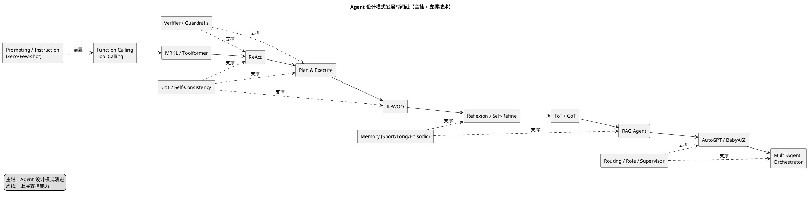
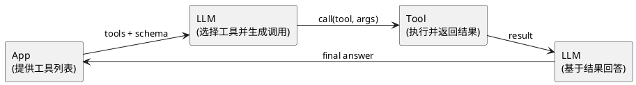
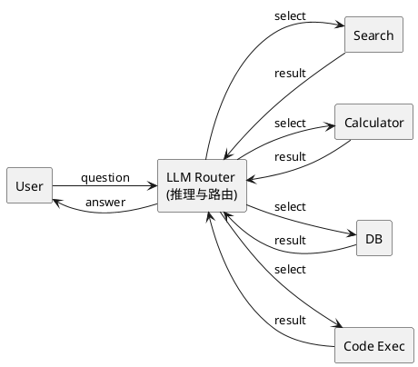

# Agent 设计模式演进

随着 Agent 技术的兴起以及作为 Codex 和 Claude Code 的重度用户，我觉得有必要对 Agent 的设计思路演进和底层实现进行深入了解。本文系统梳理了主流 Agent 设计模式，从单体推理到多 Agent 协作，帮助理解 Agent 架构的发展脉络。

## 1. 发展时间线（PlantUML）

图中主轴表示 Agent 设计模式的演进路径，从基础的工具调用到规划执行、反思改进，再到多 Agent 协作；虚线表示“支撑能力”，它们并非独立模式，而是为主轴模式提供能力加成（如 CoT、记忆、验证、路由等）。同时，Zero-shot / Few-shot 更应视为“前置能力/提示策略”，用于让模型学会按格式执行与调用工具，不属于独立设计模式。

这条发展路径可以理解为：先解决“能调用工具”的能力（Function Calling、MRKL/Toolformer），再进入“能规划并执行”的阶段（ReAct、Plan & Execute、ReWOO），随后通过反思与搜索增强可靠性（Reflexion、Self-Refine、ToT/GoT），再叠加检索与记忆形成更稳定的知识闭环（RAG/Memory），最终演进为多 Agent 编排与协作（AutoGPT/BabyAGI、Multi-Agent Orchestrator）。



## 2. 主流 Agent 设计模式清单（按层级重排）

### 前置能力（Prompting / Instruction）

##### Zero-shot

Zero-shot(零样本)是指不给大模型任何示例，直接提出问题，让模型基于其预训练知识进行推理和决策。

**核心特点:**

- 无需提供任何示例或模板
- 直接依赖模型的预训练知识
- 适用于通用任务或模型已经熟悉的场景

**示例:**

```
用户:
将文本分类为中性、负面或正面。
文本：我认为这次假期还可以。
情感：

模型: "中性"
```

在这个例子中，用户没有给出任何分类示例，模型直接基于其训练时学到的情感分析能力完成任务。这就是典型的 Zero-shot 场景。

**为什么 Zero-shot 重要？**

Zero-shot 的核心价值在于**知识迁移**能力：

1. **通用性** - 模型在海量数据上预训练后，学到的不仅是特定任务的解法，而是对语言、逻辑、世界知识的通用理解。这些知识可以迁移到从未见过的新任务上。

2. **降低使用门槛** - 用户无需准备示例、标注数据或微调模型，直接描述任务即可使用，极大降低了 AI 应用的门槛。

3. **Agent 的基础能力** - 在 Agent 系统中，Zero-shot 是模型理解指令、调用工具、执行推理的前提。没有这种知识迁移能力，Agent 就无法灵活应对各种动态任务。

例如，GPT-4 虽然没有专门训练过"写 Python 爬虫"，但它能够将对 Python 语法、HTTP 协议、HTML 结构的知识迁移组合，完成爬虫任务。这就是 Zero-shot 知识迁移的力量。

**涌现能力（Emergent Abilities）：模型规模与 Zero-shot 性能的关系**

研究显示：**模型规模增大时，zero-shot 在多任务上整体提升**。GPT‑3 论文报告了 zero‑/one‑/few‑shot 的系统评测，显示规模扩大后 zero‑shot 也显著变好。[Brown et al., 2020 (GPT-3)](https://arxiv.org/abs/2005.14165)。**不同任务存在规模阈值**，跨过后 zero‑shot 表现会明显提升。这也解释了为什么 Agent 往往依赖大模型：足够强的 zero‑shot 才能应对复杂未知任务。

##### Few-shot

虽然大模型具备不错的零样本能力，但在复杂任务上仍可能不稳定。**Few‑shot（少样本提示）**指不再训练模型，仅提供少量高质量示例（输入 + 期望输出），让模型“按示例学会规则与格式”。其核心价值在于：

1. **快速对齐意图**：示例明确任务边界与输出格式，减少误解。
2. **提升稳定性**：复杂任务下通常比 zero‑shot 更稳、更可控。
3. **降低训练成本**：无需再训练即可迁移到新任务，适合小批量、快变化场景。

在 Agent 系统中，Few‑shot 常用于**教会模型调用工具**或**遵循固定流程**（如先检索、再规划、再执行），从而提升整体可控性与成功率。

**示例（Few-shot 情感分类）**  
**任务：** 判断评论情感（正向/负向）

**示例 1**  
输入：`这款耳机音质很棒，续航也很给力。`  
输出：`正向`

**示例 2**  
输入：`物流太慢了，而且包装破损。`  
输出：`负向`

**待预测**  
输入：`屏幕清晰，但电池一般。`  
输出：`（模型据示例判断）`

### 主轴阶段（演进主线）

#### 阶段一：工具调用能力（Tool Use）

大模型并非万能：数据覆盖不全、知识不够新、推理不够可靠，且缺乏外部执行能力与可验证性；因此需要借助**工具调用**来补齐信息、执行与校验能力。

##### Function Calling

**最早的协议/做法（简化版）**可以理解为两类“约定式协议”，都是靠**提示+格式约束**让模型学会结构化输出：

**指令 + 约定格式（Prompt-Only）**  
 在系统提示中明确规定输出格式，例如：  
 “当需要工具时，只输出 JSON：`{tool: \"...\", args: {...}}`，不得输出自然语言”。  
 应用端负责**解析 JSON → 触发真实工具 → 把结果回填给模型**。  
 这一阶段的关键在于**格式稳定性**：常用技巧包括“只允许 JSON”“禁止解释”“给 1–2 个标准示例”。

**例子：指令 + 约定格式（Prompt-Only）**  
系统提示：  
“当需要工具时，只输出 JSON：`{tool: \"...\", args: {...}}`。”

用户：查一下今天北京天气  
模型输出：

```json
{ "tool": "get_weather", "args": { "location": "Beijing", "date": "today" } }
```

系统侧会**自动检测**模型输出是否为约定 JSON：

- 若匹配到 `{tool, args}` 结构，就触发对应工具执行
- 若未匹配，则视为普通文本回答

系统执行工具并回填结果：

```json
{ "temp": 6, "condition": "cloudy" }
```

模型最终回复：  
“今天北京约 6°C，多云，建议穿厚外套。”

**自动检测伪代码示例**

```js
const call = tryParseJson(modelOutput);
if (call && call.tool && call.args) {
  const result = tools[call.tool](call.args);
  const finalAnswer = askModelWithResult(result);
}
```

**函数签名 + 约定输出（Schema-Driven）**  
 提前给模型一组函数描述（函数名、参数、类型、用途、约束），模型在生成时选择合适函数并填充参数。  
 输出仍是结构化调用，但**由“函数列表 + 参数 schema”约束**，更像“协议化调用”。  
 这就是后来的 Function Calling 形态：**函数列表 + 结构化调用输出**。

**例子：函数签名 + 约定输出（Schema-Driven）**  
可用函数：

```json
[
  {
    "name": "search_docs",
    "description": "在内部文档中检索",
    "parameters": {
      "type": "object",
      "properties": {
        "query": { "type": "string" },
        "top_k": { "type": "integer" }
      },
      "required": ["query"]
    }
  }
]
```

用户：找一下“退款规则”的最新说明  
模型输出：

```json
{ "tool": "search_docs", "args": { "query": "退款规则 最新说明", "top_k": 3 } }
```

两者的共同点是：**模型不直接执行，只“发出调用意图”，系统侧执行并返回结果**。区别在于，后者更规范、可校验，适合复杂工具生态。

**Schema-Driven vs MCP（补齐了什么）**

| 维度              | Schema-Driven（函数签名 + 结构化输出） | MCP（标准化协议层）                       |
| ----------------- | -------------------------------------- | ----------------------------------------- |
| 工具发现/注册     | 手动拼接函数列表                       | 通过 server/client 握手与发现机制统一接入 |
| 调用通道/生命周期 | 只约定结构化输出                       | 规范请求/响应、流式结果、取消等过程       |
| 权限与隔离        | 依赖应用侧逻辑                         | 提供更清晰的可见性/权限边界               |
| 多工具聚合/治理   | 单应用维护为主                         | 更容易统一接入、多工具管理与版本兼容      |

##### Tool Calling Agent

Function Calling 只能覆盖“函数式接口”，但现实需求远不止函数：**搜索、数据库、浏览器、代码执行、RAG、外部服务**都需要统一接入。  
因此出现了 **Tool Calling** ——把“函数调用”扩展为“能力调用”，解决**信息不全、知识不新、外部执行与可验证性不足**的问题。

**概念**  
Tool Calling 是一种统一的能力调用范式：模型只负责选择“该用哪种工具”和“如何填参”，执行与结果回填由系统完成。（Tool Calling 在 Function Calling 的机制上扩展了语义范围，把“函数接口”扩成“能力接口”，从而覆盖搜索、检索、浏览器、代码执行等更广的工具类别）



**例子**  
用户：对比一下 iPhone 15 和 iPhone 15 Pro 的电池续航  
模型输出：

```json
{
  "tool": "web_search",
  "args": { "query": "iPhone 15 vs 15 Pro battery life" }
}
```

系统执行工具并回填检索结果后，模型再总结并给出对比结论。

##### MRKL (Modular Reasoning, Knowledge and Language)

当工具越来越多时，仅靠“能调用工具”还不够：**需要一个会“选择与路由”的中枢**，来决定该用哪个模块解决问题。  
这就引出了 **MRKL**：把推理与外部能力模块化，让 LLM 做“路由/调度中枢”。

**概念与思路**

- **LLM 负责推理与路由**：判断任务类型、选择合适模块
- **工具模块负责专用能力**：检索、计算、数据库、代码执行等
- **结果回填再推理**：工具结果回到 LLM，形成“推理 → 调用 → 观察 → 再推理”的闭环



**延伸理解（MCP CLI）**  
Claude Code 的 MCP CLI 更像是把“MRKL 的路由思路”落地为**统一的工具接入协议**：  
LLM 依旧负责选择/路由，MCP 负责标准化“工具发现、调用与返回”。([docs.anthropic.com](https://docs.anthropic.com/en/docs/claude-code/mcp?utm_source=openai))

##### ToolFormat（工具调用格式约定）

**为什么需要 ToolFormat？**

在 ReAct 和 MRKL 中，LLM 需要"表达调用意图"——告诉系统调用哪个工具、传什么参数。早期做法是让模型在自然语言中夹带调用信息，但这带来三个问题：

1. **解析不稳定**：模型可能输出 `"调用天气查询(城市:北京)"` 或 `"用 weather_api 查北京天气"`，格式不统一导致解析失败
2. **参数难校验**：自然语言描述的参数无法做类型检查和必填校验
3. **难以追踪**：调用链混在文本里，无法结构化记录和审计

**ToolFormat 就是为了解决这个问题而诞生的统一协议**——要求模型用固定的结构化格式表达调用意图，而不是自由发挥。

**概念**
ToolFormat 规定了"模型如何表达工具调用"的标准格式，通常包含：工具名、参数字典、调用原因等字段。它让调用意图变得可解析、可校验、可追踪。

**例子**
用户问："北京今天天气怎么样？"

没有 ToolFormat 时，模型可能输出：

```
"我需要查询天气，调用 get_weather，城市是北京"
```

→ 解析器需要从文本中提取工具名和参数，容易出错

有 ToolFormat 约束后，模型输出：

```json
{
  "tool": "get_weather",
  "args": { "city": "北京" }
}
```

→ 系统可以直接解析、校验参数类型、触发执行

**概念辨析**

ToolFormat 只是工具调用生态中的一环，它与其他概念配合形成完整的调用链路：

- **Function Schema**：定义"工具接受哪些参数"（工具侧的接口规范）
- **ToolFormat**：定义"模型如何表达调用意图"（模型侧的输出格式）
- **工具结果回填**：执行工具后将结果返回给模型（运行时的执行机制）

三者是独立但互补的组件：Schema 约束工具能力边界，ToolFormat 让调用可被解析，结果回填让推理能继续——它们共同支撑起 Agent 的工具调用能力。

##### Toolformer（模型自主学会使用工具）

**为什么需要 Toolformer？**

前面的 Function Calling 和 Tool Calling 都依赖"系统提供工具列表 + 模型选择调用"的模式，但这带来一些局限：

1. **依赖外部工具定义**：系统必须预先告诉模型有哪些工具可用
2. **调用与生成分离**：模型要么生成文本，要么生成工具调用，不能自然融合
3. **需要明确的触发机制**：模型需要"被告知"可以使用工具

**Toolformer 提出了一个更自然的思路：让模型在训练时就学会"何时、如何"自主插入工具调用**——就像人类写作时自然地引用资料、查询数据一样。

**概念**

Toolformer 是 Meta 在 2023 年提出的训练方法，核心思想是：

1. **工具调用是文本生成的一部分**：模型在生成过程中自然插入工具调用标记
2. **自监督学习**：模型自己生成候选调用位置，执行后评估是否有帮助，只保留有用的调用作为训练数据
3. **无需预定义工具列表**：模型从训练数据中学会"什么场景需要什么工具"

训练流程：

```
1. 模型生成文本时，在可能需要工具的地方插入候选调用
   例："2023年世界人口是 [候选: search(...)]"

2. 执行这些候选调用，获取结果

3. 评估：如果结果让后续生成更准确，保留这个调用；否则删除

4. 在过滤后的数据上微调模型
```

**例子**

用户问："费米悖论是谁提出的？他在哪年获得诺贝尔奖？"

**Function Calling 模式**：

```
系统：你可以使用 search_wiki 工具
模型：{"tool": "search_wiki", "args": {"query": "费米悖论"}}
系统：[返回结果]
模型：费米悖论由恩里科·费米提出，他在1938年获得诺贝尔物理学奖。
```

→ 调用与生成分离，需要多轮交互

**Toolformer 模式**：

```
模型直接生成：
"费米悖论由 [调用: WikiSearch("恩里科·费米")] 恩里科·费米提出，
他在 [调用: WikiSearch("恩里科·费米 诺贝尔奖")] 1938年获得诺贝尔物理学奖。"
```

→ 工具调用自然嵌入文本生成，一次完成

**与 Function Calling 的对比**

| 维度     | Toolformer         | Function Calling     |
| -------- | ------------------ | -------------------- |
| 工具发现 | 模型从训练中学会   | 系统预先提供工具列表 |
| 调用方式 | 文本生成中自然插入 | 生成结构化 JSON      |
| 控制性   | 模型自主决定       | 系统控制工具范围     |
| 灵活性   | 需要重新训练       | 可动态添加工具       |
| 安全性   | 难以限制和审计     | 可控、可审计         |
| 工程化   | 研究阶段           | 工业标准             |

**实践现状**

Toolformer 作为研究项目证明了"模型可以学会自主使用工具"，但在商业实践中：

- **主流模型（GPT-4、Claude、Gemini）采用的是 Function Calling 范式**
  - 原因：更可控、更安全、更易集成
  - 但它们在训练时融入了 Toolformer 的思想（让模型理解何时需要工具）

- **Toolformer 的价值在于思想启发**：
  - 证明了模型可以通过训练内化"工具使用"能力
  - 启发了后续模型在训练数据中加入工具调用样本
  - 推动了"模型自主判断何时需要工具"的研究方向

**为什么 Function Calling 成为主流？**

虽然 Toolformer 更"自然"，但 Function Calling 在工程实践中更成熟：

1. **安全可控**：系统决定提供哪些工具，可以审计每次调用
2. **动态扩展**：无需重新训练就能添加新工具
3. **标准化集成**：统一的 JSON 格式易于解析和执行
4. **权限管理**：可以针对不同用户/场景提供不同工具

**参考论文**：

- [Toolformer: Language Models Can Teach Themselves to Use Tools](https://arxiv.org/abs/2302.04761) (Meta AI, 2023)

#### 阶段一 -> 阶段二：关键启发（推理提示范式）

- Chain-of-Thought（CoT）：显式推理步骤促成“推理-行动”思路，为 ReAct 等模式提供启发
- Self-Consistency：多路径推理与投票提升稳定性

#### 阶段二：规划与执行（Reason + Act）

- ReAct（Reason + Act + Observation）
- Plan & Execute（先规划，再执行）
- LLM-as-Planner + Tool Executor
- Hierarchical Planning（分层规划）
- ReWOO（先推理出工具调用序列，再执行）

#### 阶段二之后：推理与搜索范式的扩展

- Tree of Thoughts（多分支搜索）
- Graph of Thoughts（图结构搜索）
- Skeleton of Thoughts / Chain-of-Verification

#### 阶段三：反思与改进（Reflection / Refinement）

- Reflexion（记忆 + 反思）
- Self-Refine（草稿-反馈-迭代）
- Critic-Agent / Judge-Agent（内置审稿人）
- ReAct + Verifier（带验证器的 ReAct）
- ReWOO + 动态调整（执行中可回退）

#### 阶段四：多 Agent 协作与编排（Multi-Agent）

- AutoGPT（多步骤自主执行）
- BabyAGI（任务分解 + 记忆）
- CAMEL（角色扮演协作）
- ChatDev / SWE-Agent（团队协作）
- Router Agent（意图路由）
- Orchestrator + Specialist Agents
- Supervisor / Manager Agent

### 支撑能力（横切能力）

#### 记忆与检索增强（Memory + RAG）

- Short-term / Long-term Memory 结构
- Episodic Memory（事件记忆）
- Vector Memory + Retrieval
- RAG + Reasoner
- RAG + Planner
- Multi-hop RAG Agent

#### 安全、验证与对齐（Safety & Verification）

- Verifier Agent
- Constitutional AI / Guardrail Agent
- Self-check

#### 路由与角色组织

- Routing / Role / Supervisor

### 领域能力扩展（Execution Environments）

- Web Agent（浏览器操作）
- Code Agent（代码执行）
- Data Agent（数据库/BI）

### 其他补充模式

- Socratic Agent（对话式澄清）
- Tool-Augmented Reasoning Agent
- Memory-Augmented Reasoning Agent

## 3. 演进脉络（占位）

- 单体推理 -> 工具调用 -> 规划/执行 -> 反思/改进 -> 多 Agent 协作
- 未来方向：更强的可控性、更安全的验证、更稳定的记忆、更可靠的执行

## 4. 待办清单

- 逐个模式按“统一模板”补全内容
- 每个模式至少补充 1 个代表论文 + 1 个开源项目
